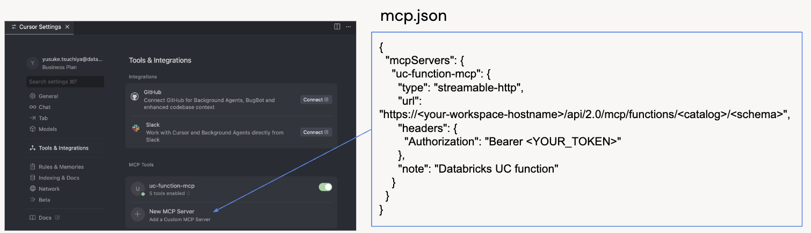

# MCP_and_vibe_coding_demo

## 使用手順

1. `env.dbx-sql` に以下を設定
   * DATABRICKS_SERVER_HOSTNAME：Databricksのホスト名
   * DATABRICKS_HTTP_PATH：SQLウェアハウスのHTTPパス
   * DATABRICKS_ACCESS_TOKEN：パーソナルアクセストークン
2. Cursor上で mcp.json を設定
   
3. run.sh を実行し、アプリをローカルで起動
4. Databricks Appsでアプリを実行する場合は、[Doc](https://docs.databricks.com/aws/ja/dev-tools/databricks-apps/) に従って構成ファイルなどを作成し、デプロイを実行

## デモ動画
